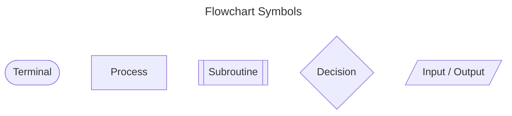
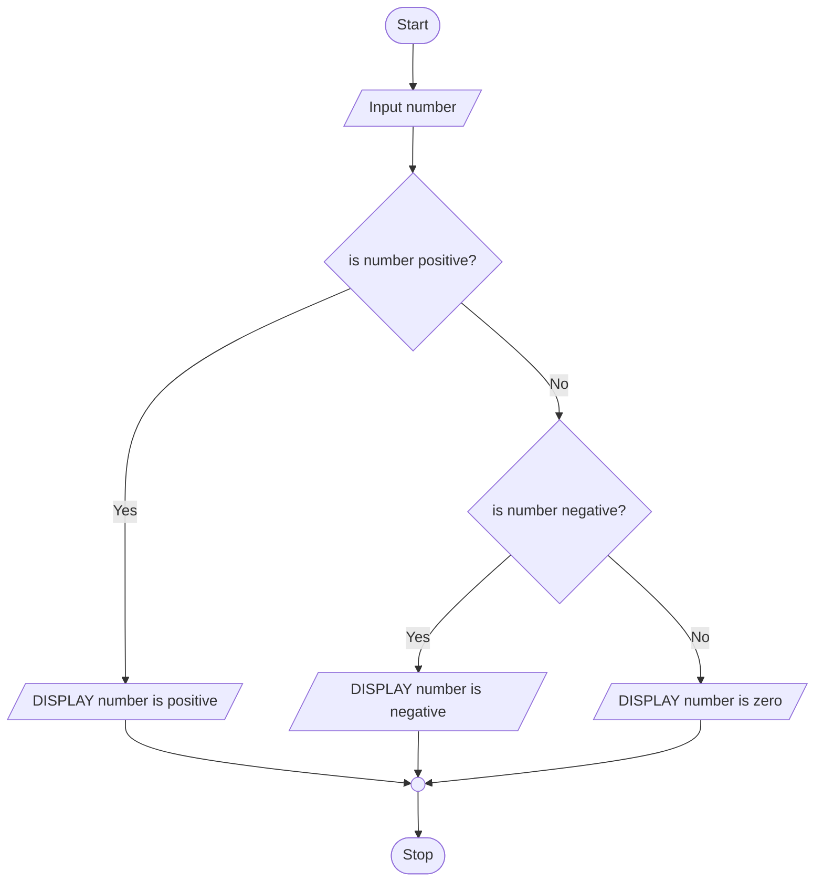
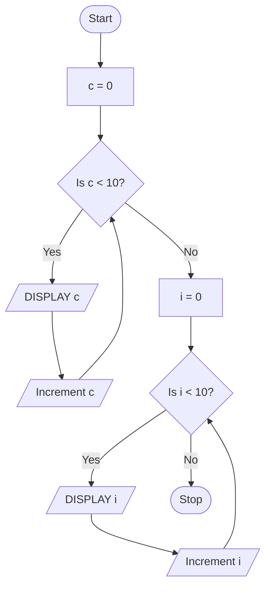
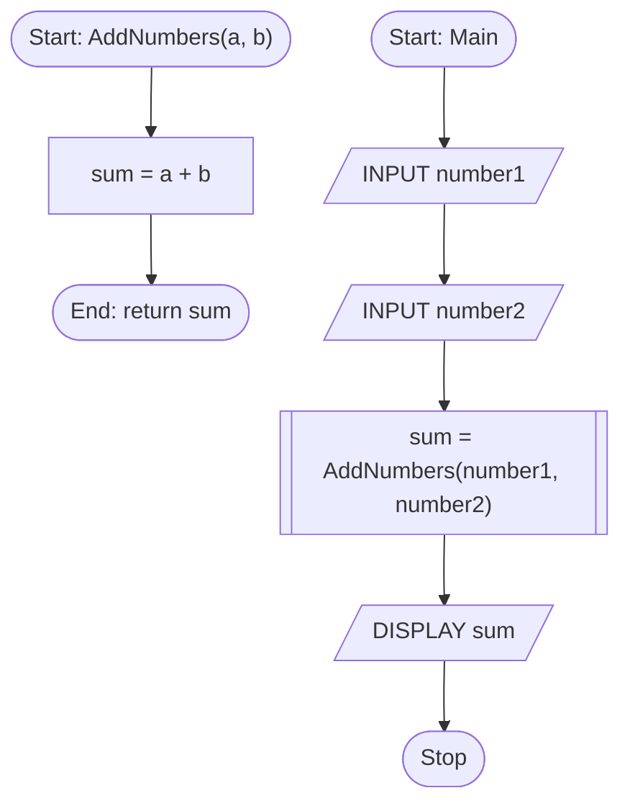

# Flowchart Symbols
- **Terminal** nodes are used to begin or end the flowchart. There should only be one start and one end point.

- **Input / Output** (Parallelograms) nodes are used to represent where a program needs to recieve or return data to the user. This can be used to represent using `print()` to output data or `input()` to output data.

- **Decision** nodes (Diamonds) are used to represent where code may branch dependant on the result of a logical statement. Decisions should only result in Yes or No answers and thus only have two branches. This can be used to represent *Selection Statements* (`if`, `elif`, `else` / `match`, `case`) and/or *Iteration Statements* (`while` / `for`) in Python.

- Process nodes (Rectangles) are used to show any process being carried out on data such as arithmetic or other forms of data-manipulation. In general if no other node fits it is likely a process node.

- **Subroutine** nodes (Paralleograms) are used to represent a group of statements (normally by referring to another flowchart). This can be used to represent *Methods* that you have defined with `def` in Python.

- **Connector** nodes (Circles) are used to join multiple branched paths together.

# Selection Statements
## Python
The following Python code takes a the users input as an integer and then returns if it is positive, negative or zero.
```python
number = int(input("Enter a number: "))
if number > 0:
    print(number, 'is positive.')
elif number < 0:
    print(number, 'is negative.')
else:
    print(number, 'is zero.')
```
## Pseudocode
This is a pseudocode equivalent to the above Python code.
```
INPUT number AS integer
IF number is positive THEN
    PRINT number is positive
ELSE IF number is negative THEN
    PRINT number is negative
ELSE
    PRINT number is zero
```
## Flowcharts
This is a flowchart equivalent to the above Python code.

# Iteration Statements
## Python
The following Python code shows two examples of loops using `while` and `for` syntax. Both loops iterate from 0 to 10 incrementing by 1 and printing the current value of their iterator.
```python
c = 0
while c < 10:
    print(c)
    c += 1

for i in range(0, 10, 1):
    print(i)
```
## Pseudocode
This is a pseudocode equivalent to the above Python code.
```
c = 0
LOOP WHILE c < 10
    PRINT c
    increment c

FOR i FROM 0 TO 10 INC 1 // Suggested syntax
    PRINT i
```
## Flowchart
This is a flowchart equivalent to the above Python code.

# Method Calls
## Python
The following Python code shows a method called *AddNumbers* which adds two numbers together and returns their sum. The program gets two integers from the user and uses the *AddNumbers* method to calculate their sum and then print it to the screen.
```python
def AddNumbers(a: int, b: int) -> int:
    sum = a + b
    return sum

number1 = int(input("Number 1: "))
number2 = int(input("Number 2: "))
sum = AddNumbers(number1, number2)
print(sum)
```
## Pseudocode
This is a pseudocode equivalent to the above Python code.
```
METHOD AddNumbers(a, b)
    sum = a + b
    RETURN sum

INPUT number1 AS integer
INPUT number2 AS integer
sum = AddNumbers(number1, number2)
DISPLAY sum
```
## Flowchart
This is a flowchart equivalent to the above Python code.


# Notes
All flowcharts in this document were made using [Mermaid](https://mermaid.js.org/). To properly display these diagrams you should use the Visual Studio Code extension [Markdown Preview Mermaid Support](https://marketplace.visualstudio.com/items?itemName=bierner.markdown-mermaid).